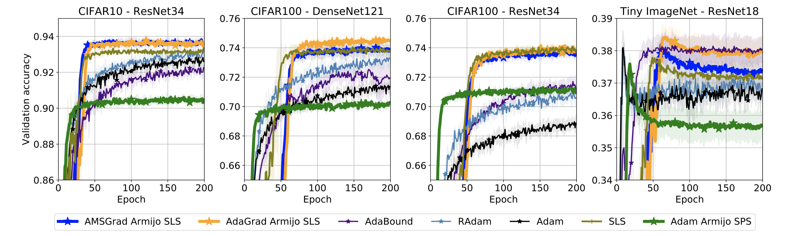

# Ada-SLS
## Adaptive Gradient Methods Converge Faster with Over-Parameterization (and you can do a line-search) [[Paper]](https://arxiv.org/abs/2006.06835)

Our `AMSGrad Armijo SLS` and `AdaGrad Armijo SLS`  consistently achieve best generalization results.


## Installation
```
pip install git+https://github.com/IssamLaradji/adasls.git
```


## Usage

Use AdaSls in your code by adding the following script.

```
import adasls
opt = adasls.AdaSLS(model.parameters())

for epoch in range(100):
    opt.zero_grad()
    closure = lambda : torch.nn.MSELoss()(model(X), Y)
    opt.step(closure=closure)
```

## Experiments

Install the requirements

`pip install -r requirements.txt` 

Run the experiments for the paper using the command below:

```
python trainval.py -e ${GROUP}_{BENCHMARK} -sb ${SAVEDIR_BASE} -d ${DATADIR} -r 1
```

with the placeholders defined as follows.

**{GROUP}**: 

Defines the set of optimizers to run, which can either be,

- `nomom` for opimizers without momentum; or
- `mom` for opimizers with momentum.

**{BENCHMARK}**: 

Defines the dataset, evaluation metric and model for the experiments (see `exp_configs.py`), which can be,

- `syn` for the synthetic experiments;
- `kernels` for the kernel experiments;
- `mf` for matrix factorization experiments;
- `mnist` for the mnist experiments;
- `cifar10`, `cifar100`, `cifar10_nobn`, `cifar100_nobn` for the cifar experiments; or
- `imagenet200`, `imagenet10` for the imagenet experiments.

**{SAVEDIR_BASE}**: 

Defines the absolute path to where the results will be saved.

**{DATADIR}**: 

Defines the absolute path containing the downloaded datasets.


## Cite
```
@article{vaswani2020adaptive,
  title={Adaptive Gradient Methods Converge Faster with Over-Parameterization (and you can do a line-search)},
  author={Vaswani, Sharan and Kunstner, Frederik and Laradji, Issam and Meng, Si Yi and Schmidt, Mark and Lacoste-Julien, Simon},
  journal={arXiv preprint arXiv:2006.06835},
  year={2020}
}
```
